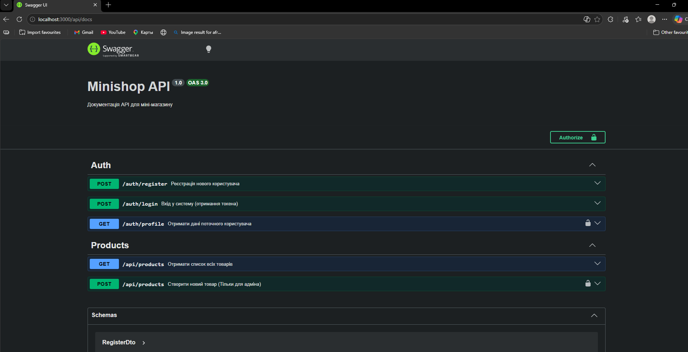

! # Student
- Name: Лендєл Е.Т.
- Group: 232.2 он

## Практичні заняття №5 та №6 — MiniShop API (JWT + RBAC + Swagger + Interceptors)

### Опис проекту
MiniShop API — це сервіс для управління інтернет-магазином, що включає систему автентифікації, розмежування прав доступу (адмін/користувач), стандартизовану обробку відповідей та автоматичну документацію.

---

### Структура репозиторію
``` ``` 
.
├── src/
│   ├── auth/ 
│   ├── categories/
│   ├── products/
│   ├── common/
│   │   ├── interceptors/
│   │   │   ├── logging.interceptor.ts
│   │   │   └── transform.interceptor.ts
│   │   ├── filters/
│   │   │   └── http-exception.filter.ts
│   │   └── guards/ & decorators/
│   ├── main.ts
│   └── app.module.ts
├── swagger-screenshot.png
├── Dockerfile
├── docker-compose.yml
└── README.md
``` ``` 

---

### Запуск проекту
``` ``` ```bash
cp .env.example .env
docker compose up --build
``` ``` ```

---

### Swagger UI (Документація API)
Документація доступна за адресою: http://localhost:3000/api/docs



---

### API Ендпоінти
| Метод  | URL               | Опис                           | Доступ |
|--------|-------------------|--------------------------------|--------|
| POST   | /auth/register    | Реєстрація користувача         | Публічний|
| POST   | /auth/login       | Авторизація (отримання JWT)    | Публічний|
| GET    | /api/products     | Отримати список товарів        | Публічний|
| POST   | /api/products     | Створити товар                 | Admin|
| GET    | /api/categories   | Отримати категорії             | Публічний|
| POST   | /api/categories   | Створити категорію             | Admin|

---

### Результати тестування

#### 1. Формат успішної відповіді (TransformInterceptor)
``` ``` json
{
  "data": { ... },
  "statusCode": 200,
  "timestamp": "2026-05-06T17:00:00.000Z"
}
``` ``` 

### 2. Формат помилки (HttpExceptionFilter)
``` ``` json
{
  "error": {
    "code": 400,
    "message": "Validation failed",
    "traceId": "a1b2c3d4-e5f6..."
  },
  "timestamp": "2026-05-06T17:05:00.000Z"
}
``` ``` ```

#### 3. Логування (LoggingInterceptor)
Кожен запит логується в консоль Docker:
`LOG [HTTP] GET /api/products — 200 — 15ms`.